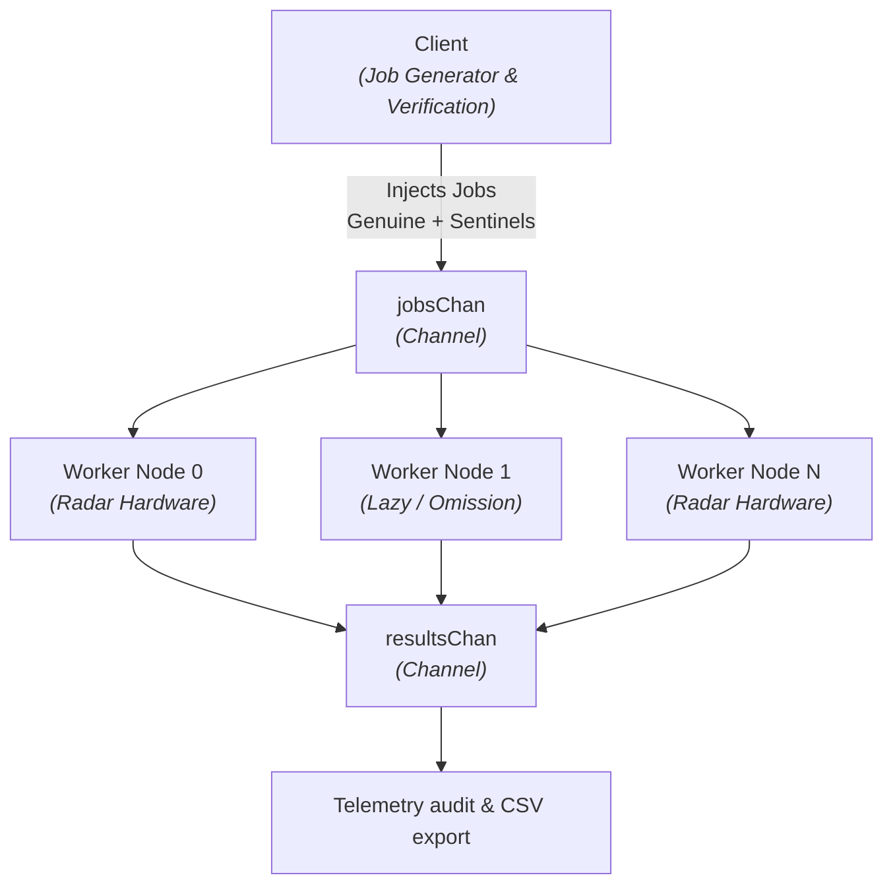

# RadarNet

> **Un simulatore concorrente ad alte prestazioni scritto in Go per l'analisi di comportamenti opportunistici (Modello BAR) in reti di radar distribuite.**

---

## 📌 Indice
- [Project Summary](#-project-summary)
- [System Architecture](#-system-architecture)
- [Quickstart](#-quickstart)

---

## 📖 Project Summary

This project implements a concurrent simulation engine in **Go** that models a network of distributed radar/receiver nodes. It introduces a **Sentinel Verification Protocol** to detect opportunistic, lazy, or degraded nodes that return non-conformant calculations or fake idle states instead of computing real signal measurements.

* **Telemetry Signal Analysis:** Conversion from polar to Cartesian coordinates, dynamic calculation of **Radar Cross Section ($RCS$)** and **Signal-to-Noise Ratio ($SNR = \frac{1000}{Range^2}$)**.
* **Distributed Data Integrity:** Fraud detection mechanism utilizing pre-computed ground-truth jobs (*Sentinels*) injected into the stream.
* **High-Throughput Concurrency:** Asynchronous non-blocking pipeline using **Go channels** and **Worker Pools** for high telemetry throughput.
* **Realistic Environment Stochastic Modeling:** Application of the **Zipf distribution** ($\alpha = 3.0$) to model non-uniform space target detection frequencies.

---

## 📐 System Architecture


### Module Breakdown
* **`main.go`**: System orchestrator. Manages the concurrent worker pool, channel routing, and simulation reporting.
* **`network.go`**: Network topology definition and task routing mechanism.
* **`radar.go`**: Hardware simulation engine. Models spatial geometry, signal processing, Gaussian noise addition, and lazy/omission behaviors.
* **`client.go`**: Control manager. Generates Sentinel ground truths, validates worker computations, and handles structured CSV logging.
* **`zipf.go`**: Stochastic generator for non-uniform spatial event distributions.

### Technical Parameters
* `numRadars`: number of concurrent radar nodes
* `totalJobs`: total number of jobs to be computed
* `sentinelRate`: proportion of jobs reserved for audit
* `radarOmissionRate`: proportion of jobs omitted by radar at the specified id
* `Zipf alpha`: skeweness factor of events distribution

## 🚀 Quickstart

### Prerequisites
* **Go 1.20+** installed on your machine.

### Execution

```bash
# Clone repository
git clone https://github.com/Syd00/RadarNet.git
cd RadarNet

# Run the simulation engine
go run .
```
