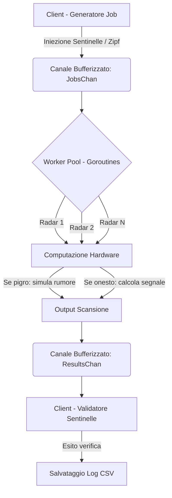

# RadarNet

> **Un simulatore concorrente ad alte prestazioni scritto in Go per l'analisi di comportamenti opportunistici (Modello BAR) in reti di radar distribuite.**

---

## 📌 Indice
- [Panoramica del Progetto](#-panoramica-del-progetto)
- [Architettura e Modello di Controllo](#-architettura-e-modello-di-controllo)
- [Caratteristiche Principali](#-caratteristiche-principali)
- [Tech Stack](-tech-stack)

---

## 📖 Panoramica del Progetto

**BAR-RadarNet** modella e simula una rete di nodi radar fisici operanti sotto il framework **BAR (Byzantine-Altruistic-Rational)**. In contesti decentralizzati ed edge computing, i nodi (Worker) possono comportarsi in modo opportunistico/razionale per risparmiare risorse computazionali o energetiche, omettendo calcoli e falsificando le risposte (mimetismo termico/gaussiano).

Il progetto implementa un sistema di validazione proattivo basato su **Sentinelle (Ground Truth)** inserite stocasticamente nel flusso dei job per rilevare e quantificare l'omissione fraudolenta da parte dei nodi pigri.

---

## 📐 Architettura e Modello di Controllo

La simulazione è strutturata su un'architettura **Producer-Consumer asincrona concorrente** sfruttando i canali nativi e le goroutine di Go.

## ✨ Caratteristiche Principali
- **Worker Pool Concorrente (Go):** Gestione asincrona parallela dei nodi fisici tramite goroutine e canali isolati per prevenire colli di bottiglia o race condition.
- **Distribuzione di Zipf stocastica:** Generatore matematico integrato per simulare lo sbilanciamento del traffico ambientale reale in contesti di telerilevamento.
- **Strategie di Allocazione delle Sentinelle:** Supporto ad allocazioni Uniformi per massimizzare probabilità di rilevamento.

## 🛠️ Tech Stack
- **Go:** Core Engine, Concorrenza, Strutture Dati e Generazione Matematica.
- **Formato dati:** CSV strutturato per l'interoperabilità tra l'engine di simulazione e la pipeline analitica.
